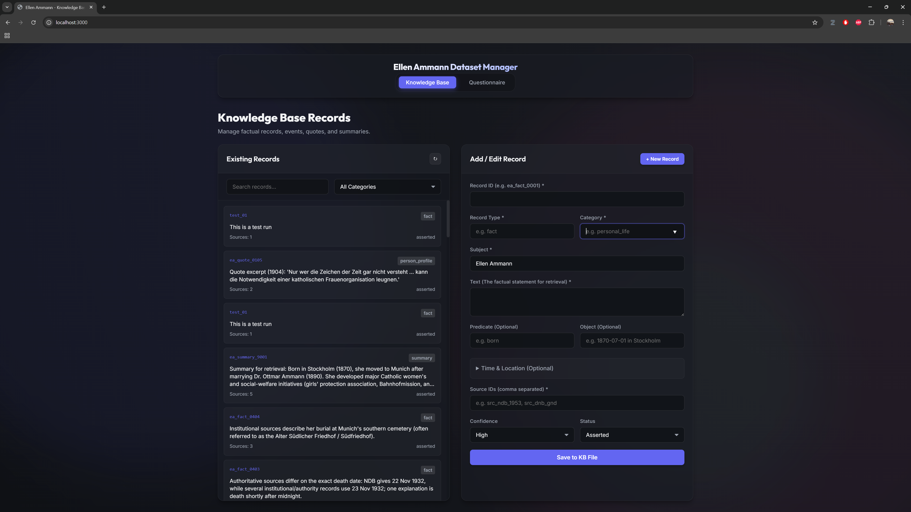
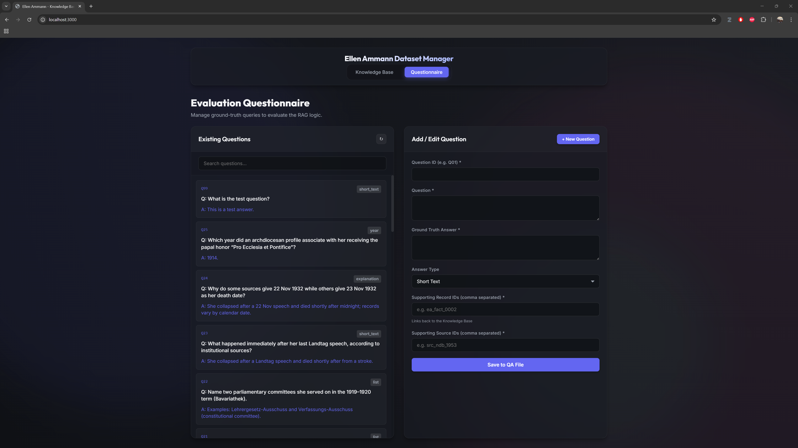

# Knowledge Architect

This project is a lightweight, local web application designed to help users build structured **Knowledge Bases (KB)** and **Evaluation Questionnaires (QA)** for RAG (Retrieval-Augmented Generation) systems. It supports multiple independent sessions, allowing you to manage different datasets and subject matters in one tool.

## Application Preview

Below is how the application should look when it is running. You can switch between the Knowledge Base and the Evaluation Questionnaire tabs.

### Knowledge Base (KB) Interface



### Evaluation Questionnaire (QA) Interface



## Installation & Setup

### Windows Quick Start

1. **Start:** Once the build is complete, double-click on `start.bat` to launch the application.

### Linux VM (Docker - Recommended)

1. **Requirement:** Ensure [Docker](https://docs.docker.com/get-docker/) and [Docker Compose](https://docs.docker.com/compose/install/) are installed.
2. **Build & Run:** Run the following in the project directory to build the image and start the container directly on your VM's network:

   ```bash
   docker build -t knowledge-architect .
   docker run -d --network host --name ka-server -v $(pwd)/sessions:/usr/src/app/sessions knowledge-architect
   ```

3. **Access:** Open `http://137.250.171.226:3001` in your browser.

### Linux VM (Direct)

1. **Build:** Run `./build.sh` (this installs dependencies via npm).
2. **Start:** Run `./start.sh`.
3. **Access:** Open `http://your-vm-ip:3001` in your browser.

### Alternative Editing

While the web tool is recommended for visualising and managing the database, you can also simply edit the raw data files directly:

- `ellen_ammann_kb.jsonl` (Knowledge Base)
- `ellen_ammann_eval_qa.jsonl` (Evaluation Questionnaire)

If you have any questions or need assistance, please feel free to reach out!

## Getting Started

**If you are looking to learn how to use this tool to build your dataset, please read the [User Manual](User_Manual.md) first!** The manual covers starting the application, making edits, deleting entries, and safely backing up your progress.

## Codebase Overview

The codebase is a simple, no-build-required, full-stack application. It prioritizes ease of use and aesthetics without overly complex dependencies.

### Tech Stack

- **Backend:** Node.js with Express.js (`server.js`)
- **Frontend:** Vanilla HTML (`public/index.html`), CSS (`public/style.css`), and JavaScript (`public/app.js`)
- **Data Storage:** Local `.jsonl` files (JSON Lines format)

### Directory Structure

- [`server.js`](server.js): The main backend server file.
- [`public/`](public): Contains the frontend assets.
- `sessions/`: Stores independent dataset sessions, each with its own `.jsonl` files and backups.
- `.bat` / `.sh` scripts: Helper scripts for Windows and Linux to build, start, and stop the application.

## How it uses JSONL Data

The core of this application is its interaction with JSON Lines (`.jsonl`) files. A `.jsonl` file operates differently than a standard `.json` file: instead of being one massive JSON array, **each individual line is a fully valid, standalone JSON object.**

This is ideal for large datasets (like training LLMs or building KBs) because a program can read or append one line at a time without having to parse the entire file into memory stringify it all at once.

### Backend Data Handling

1. **Reading**: When the frontend requests data (e.g., `GET /api/kb`), the backend Node.js server reads `ellen_ammann_kb.jsonl`. It splits the text file by line breaks (`\n`), parses each line using `JSON.parse()`, and sends the resulting array of objects to the frontend.
2. **Writing/Editing**: When a user saves a record, they send a JSON object to the backend (`POST /api/kb`). The backend reads the existing `.jsonl` file, checks if the `record_id` already exists, and either *replaces* that specific object in the array (if editing) or *pushes* a new object (if appending). It then converts the entire array back into a `\n` delineated string and overwrites the file.
3. **Deleting**: Similar to writing, the backend filters out the deleted ID and rewrites the remaining records to the file.

*Before any modification, the [`server.js`](server.js) script automatically generates a timestamped backup in the `data/` folder.*

## JSONL Data Structures

The system manages two distinct types of data:

### 1. Knowledge Base ([`ellen_ammann_kb.jsonl`](ellen_ammann_kb.jsonl))

This file stores factual claims, biographical events, quotes, and summaries about Ellen Ammann.

**JSON Architecture:**

```json
{
  "record_id": "ea_fact_0105",
  "record_type": "fact",  // e.g., fact, event, person_profile, quote
  "category": "personal_life", // e.g., personal_life, political_life
  "subject": "Ellen Ammann",
  "text": "Born in Stockholm (1870), she moved to Munich after marrying...",
  "predicate": "born", // Optional
  "object": "1870-07-01 in Stockholm", // Optional
  "time": "1870-07-01", // Optional
  "location": "Stockholm, Sweden", // Optional
  "source_ids": ["src_ndb_1953"], // Array of evidence sources
  "confidence": "High",
  "status": "Asserted", // Or "Disputed"
  "conflict_set_id": "" // Populated if status is "Disputed"
}
```

### 2. Evaluation Questionnaire ([`ellen_ammann_eval_qa.jsonl`](ellen_ammann_eval_qa.jsonl))

This file stores ground-truth questions and answers used to evaluate how well the RAG model retrieves the aforementioned KB facts.

**JSON Architecture:**

```json
{
  "qid": "Q01",
  "question": "In what year was Ellen Ammann born?",
  "ground_truth_answer": "Ellen Ammann was born in 1870.",
  "supporting_record_ids": ["ea_fact_0105"], // Points back to the KB record_id
  "supporting_source_ids": ["src_ndb_1953"]
}
```
